<div align="center">

# Recommal

**A cross-domain recommender. Pick an anime and get video games. Pick a game and get anime.**

[](https://github.com/mdtarek-islam/recommal/actions/workflows/ci.yml)


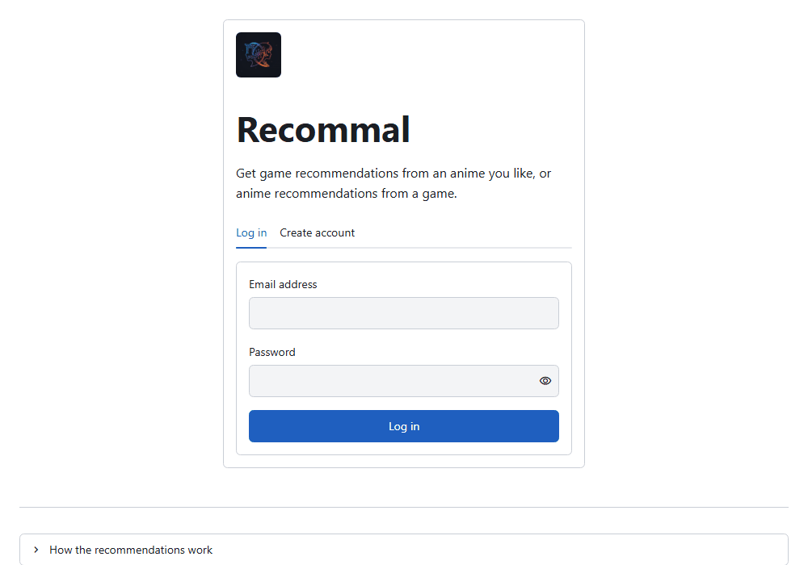

</div>

## Contents

1. [Why this exists](#why-this-exists)
2. [Screens](#screens)
3. [How it works](#how-it-works)
4. [Results](#results)
5. [Quick start](#quick-start)
6. [Project layout](#project-layout)
7. [Testing](#testing)
8. [Security notes](#security-notes)
9. [Deployment](#deployment)
10. [Limitations](#limitations)
11. [Licence](#licence)
12. [Acknowledgements and sources](#acknowledgements-and-sources)

## Why this exists

Anime catalogues and game catalogues use different vocabularies. MyAnimeList genres describe themes. Steam genres describe gameplay.
A fan of one domain has no easy way to find matching titles in the other.

Recommal maps both domains into one shared vector space. Content is the only input: a title and a synopsis.
The system has no user interaction history. Cosine similarity in the shared space ranks candidates from the other domain.

<p align="center">
  
</p>

## Screens

All screens come from the running Streamlit app.

| Desktop login | Mobile login |
|---|---|
| 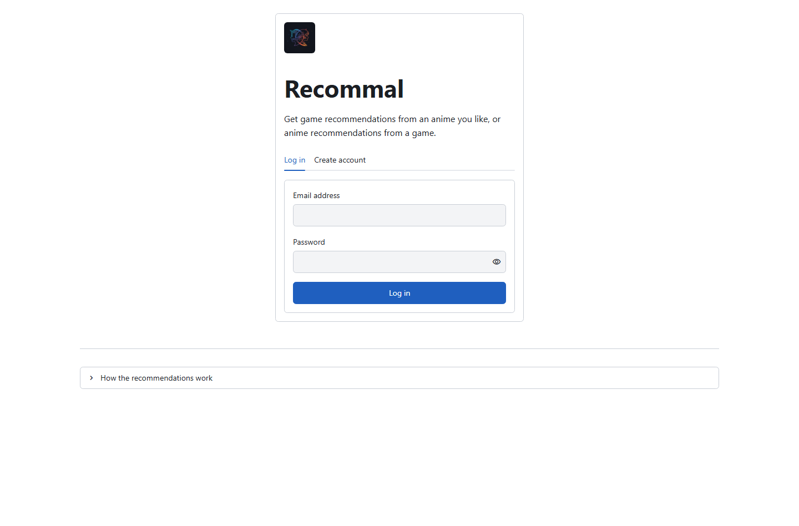 | 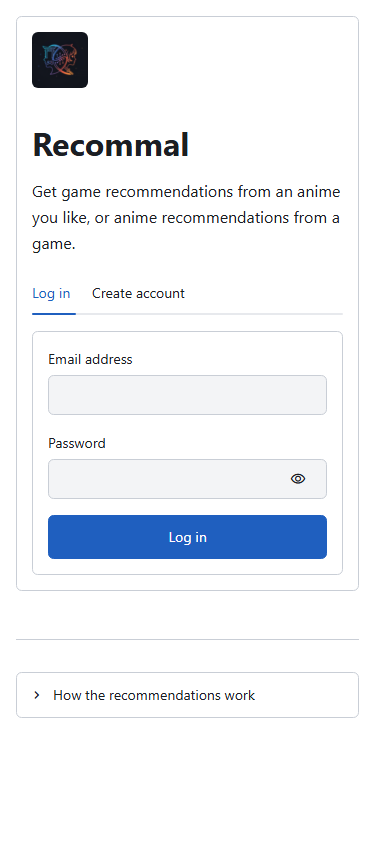 |

**Search.** The user picks a domain and types a title. Trigram indexes serve the case-insensitive search.

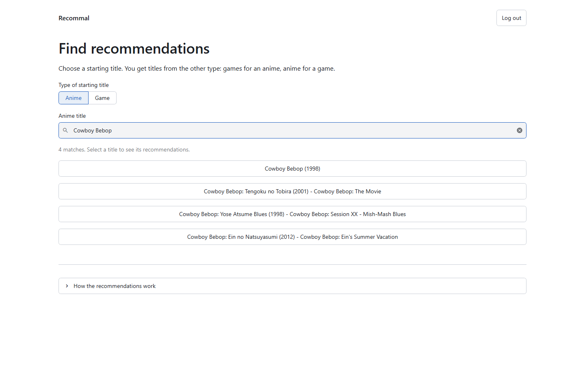

**Results.** The A/B test shows each user one of two layouts. The `control` layout ranks by latent similarity. The `explained` layout adds a popularity prior and the shared themes.

| Control layout (anime query) | Explained layout (anime query) |
|---|---|
| 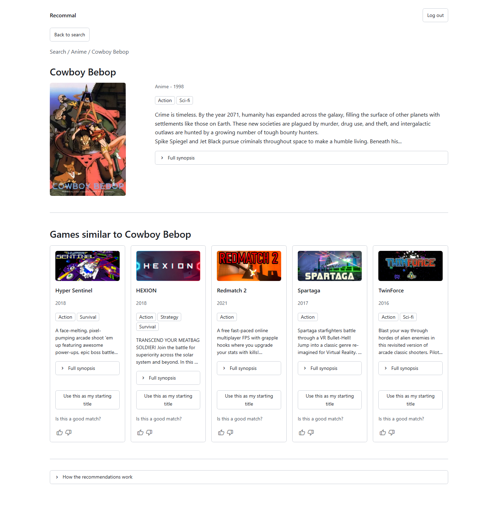 | 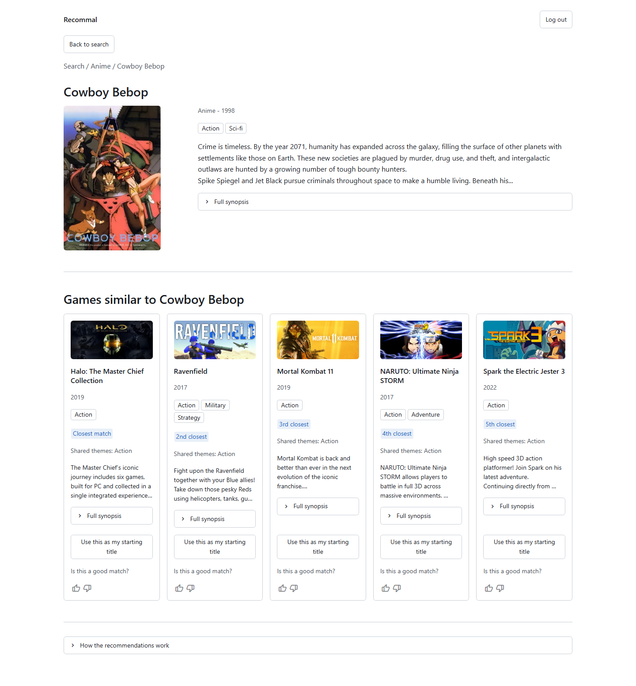 |

| Explained layout (game query) | Explained layout (mobile) |
|---|---|
| 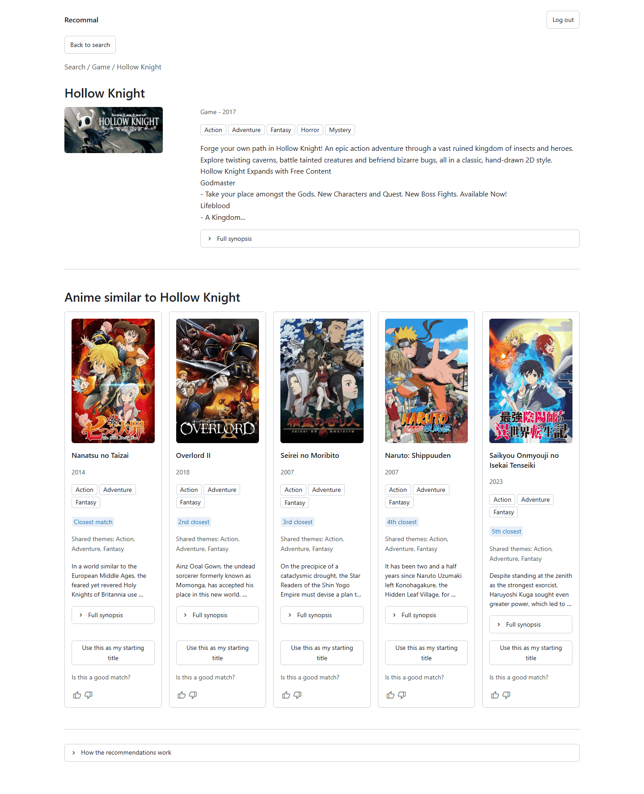 | 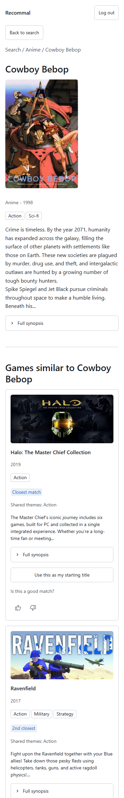 |

| Dark theme | A weak example |
|---|---|
| 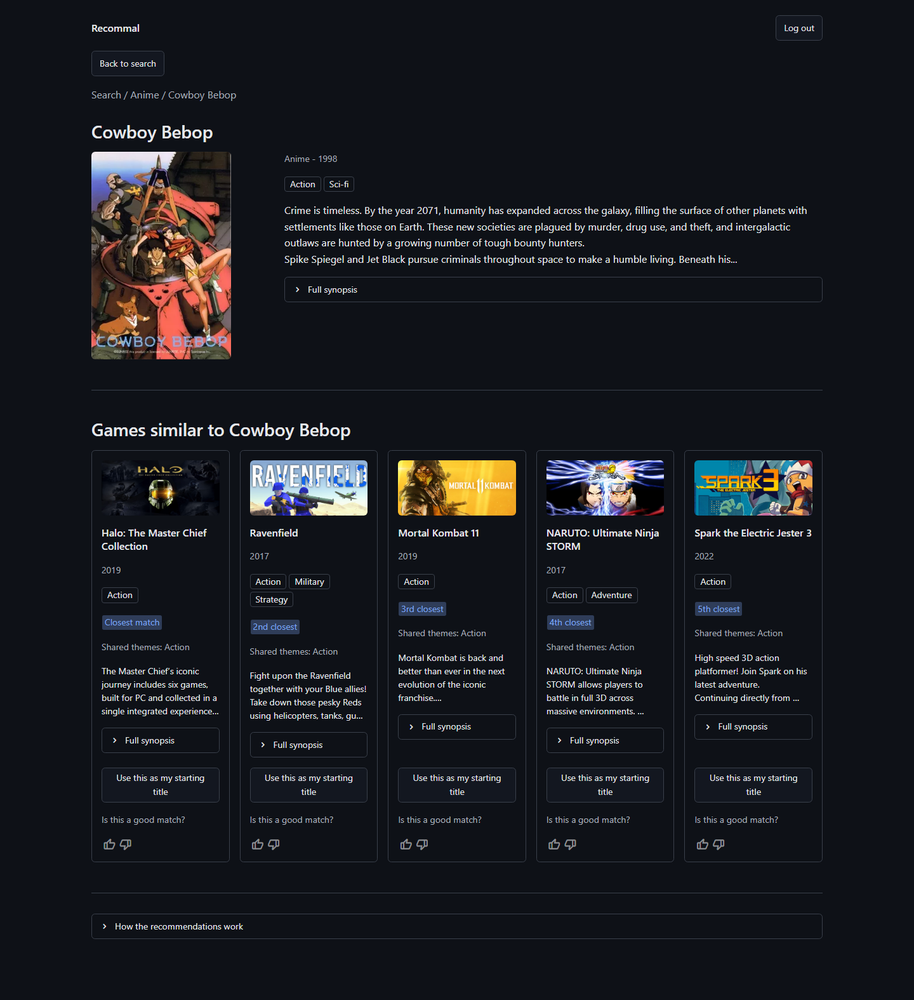 | 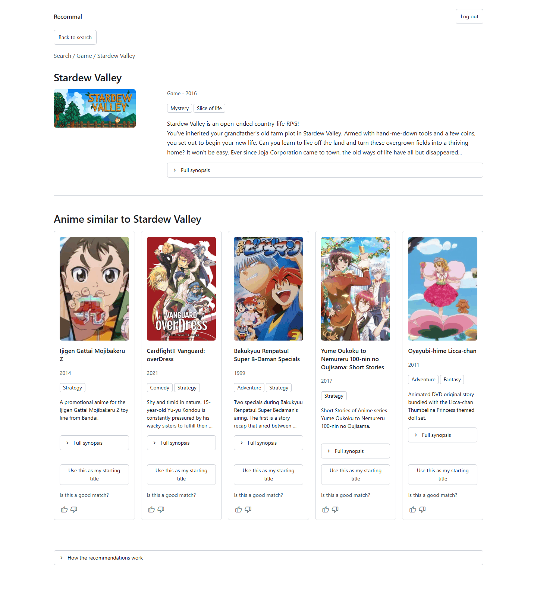 |

The weak example is deliberate. Theme overlap is a thin signal. Some lists contain titles that a person would not pair. See [Limitations](#limitations).

## How it works

### System architecture

The web app is online. The ML pipeline runs offline on a developer machine. Only precomputed rows reach the database.

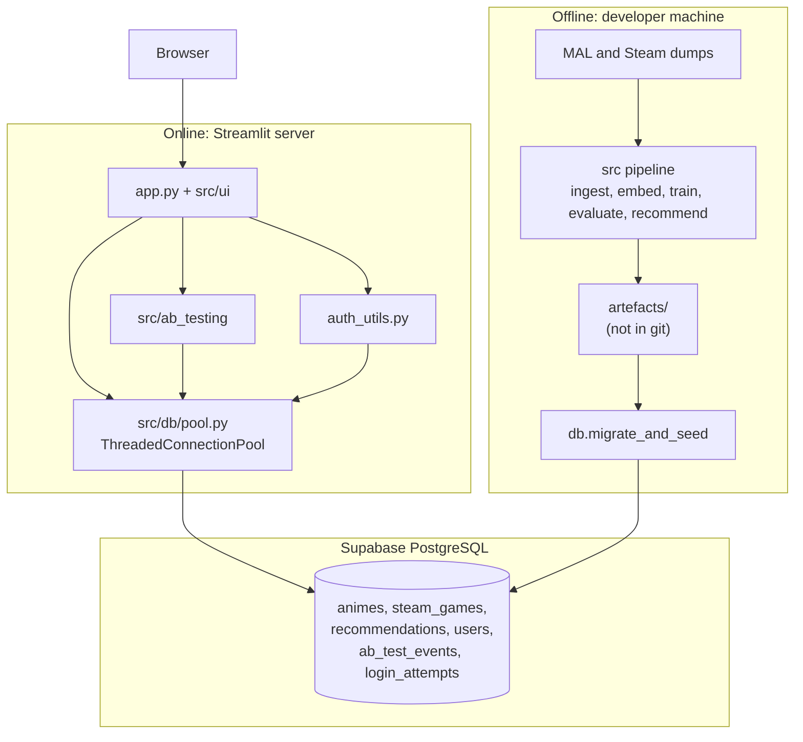
```mermaid
flowchart TB
    subgraph Online["Online: Streamlit server"]
        UI["app.py + src/ui"]
        AB["src/ab_testing"]
        AUTH["auth_utils.py"]
        POOL["src/db/pool.py<br/>ThreadedConnectionPool"]
        UI --> AB
        UI --> AUTH
        UI --> POOL
        AB --> POOL
        AUTH --> POOL
    end
    subgraph Supa["Supabase PostgreSQL"]
        DB[("animes, steam_games,<br/>recommendations, users,<br/>ab_test_events, login_attempts")]
    end
    subgraph Offline["Offline: developer machine"]
        DUMPS["MAL and Steam dumps"] --> PIPE["src pipeline<br/>ingest, embed, train, evaluate, recommend"]
        PIPE --> ART["artefacts/<br/>(not in git)"]
        ART --> SEED["db.migrate_and_seed"]
    end
    Browser["Browser"] --> UI
    POOL --> DB
    SEED --> DB
```

### Offline pipeline

Run the stages in this order. Each stage reads the output of the stage before it.

<p align="center">
  
</p>

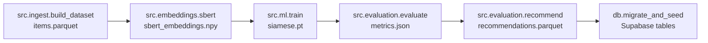
```mermaid
flowchart LR
    A["src.ingest.build_dataset<br/>items.parquet"] --> B["src.embeddings.sbert<br/>sbert_embeddings.npy"]
    B --> C["src.ml.train<br/>siamese.pt"]
    C --> D["src.evaluation.evaluate<br/>metrics.json"]
    D --> E["src.evaluation.recommend<br/>recommendations.parquet"]
    E --> F["db.migrate_and_seed<br/>Supabase tables"]
```

### Weak supervision: where the labels come from

The original pipeline labelled pairs with SBERT cosine similarity. That label depends on the model input.
The rebuild defines relevance from a taxonomy of 23 canonical themes (`THEMES` in `src/ingest/themes.py`).

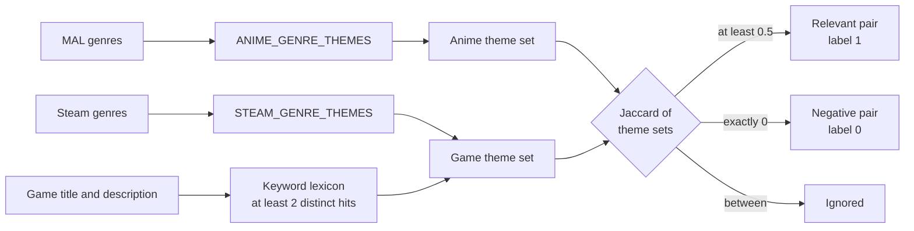
```mermaid
flowchart LR
    MG["MAL genres"] --> AM["ANIME_GENRE_THEMES"]
    SG["Steam genres"] --> SM["STEAM_GENRE_THEMES"]
    GD["Game title and description"] --> LX["Keyword lexicon<br/>at least 2 distinct hits"]
    AM --> AT["Anime theme set"]
    SM --> GT["Game theme set"]
    LX --> GT
    AT --> J{"Jaccard of<br/>theme sets"}
    GT --> J
    J -->|"at least 0.5"| P["Relevant pair<br/>label 1"]
    J -->|"exactly 0"| N["Negative pair<br/>label 0"]
    J -->|"between"| X["Ignored"]
```

### Model: two-tower Siamese encoder

Both towers share one set of weights. The linear residual path keeps the SBERT geometry. The MLP path learns the cross-domain shift.
LayerNorm replaces BatchNorm, so single-item inference matches training. The output layer is linear.

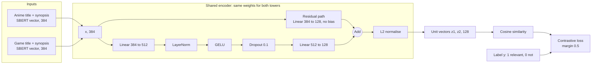
```mermaid
flowchart LR
    subgraph IN["Inputs"]
        a["Anime title + synopsis<br/>SBERT vector, 384"]
        g["Game title + synopsis<br/>SBERT vector, 384"]
    end
    subgraph ENC["Shared encoder: same weights for both towers"]
        x["x, 384"]
        res["Residual path<br/>Linear 384 to 128, no bias"]
        l1["Linear 384 to 512"]
        ln["LayerNorm"]
        ge["GELU"]
        dr["Dropout 0.1"]
        l2["Linear 512 to 128"]
        add(("Add"))
        nrm["L2 normalise"]
        x --> res --> add
        x --> l1 --> ln --> ge --> dr --> l2 --> add
        add --> nrm
    end
    a --> x
    g --> x
    nrm --> z["Unit vectors z1, z2, 128"]
    z --> cos["Cosine similarity"]
    cos --> loss["Contrastive loss<br/>margin 0.5"]
    y["Label y: 1 relevant, 0 not"] --> loss
```

### Database

The ER diagram follows `db/migrations/001_initial_schema.sql` and `002_security_hardening.sql`.
The table `recommendations` has no foreign key. Its arrays point to `animes` or `steam_games`, chosen by domain. The seed script checks integrity.

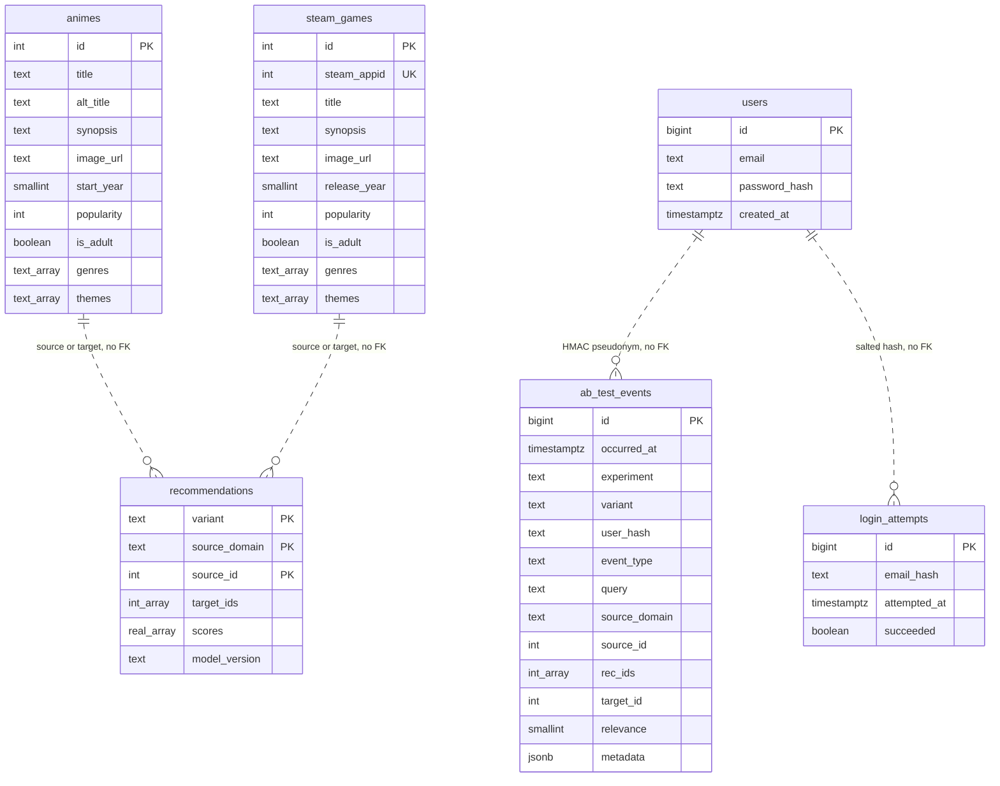
```mermaid
erDiagram
    animes {
        int id PK
        text title
        text alt_title
        text synopsis
        text image_url
        smallint start_year
        int popularity
        boolean is_adult
        text_array genres
        text_array themes
    }
    steam_games {
        int id PK
        int steam_appid UK
        text title
        text synopsis
        text image_url
        smallint release_year
        int popularity
        boolean is_adult
        text_array genres
        text_array themes
    }
    recommendations {
        text variant PK
        text source_domain PK
        int source_id PK
        int_array target_ids
        real_array scores
        text model_version
    }
    users {
        bigint id PK
        text email
        text password_hash
        timestamptz created_at
    }
    ab_test_events {
        bigint id PK
        timestamptz occurred_at
        text experiment
        text variant
        text user_hash
        text event_type
        text query
        text source_domain
        int source_id
        int_array rec_ids
        int target_id
        smallint relevance
        jsonb metadata
    }
    login_attempts {
        bigint id PK
        text email_hash
        timestamptz attempted_at
        boolean succeeded
    }
    animes ||..o{ recommendations : "source or target, no FK"
    steam_games ||..o{ recommendations : "source or target, no FK"
    users ||..o{ ab_test_events : "HMAC pseudonym, no FK"
    users ||..o{ login_attempts : "salted hash, no FK"
```

### One request: search to recommendations

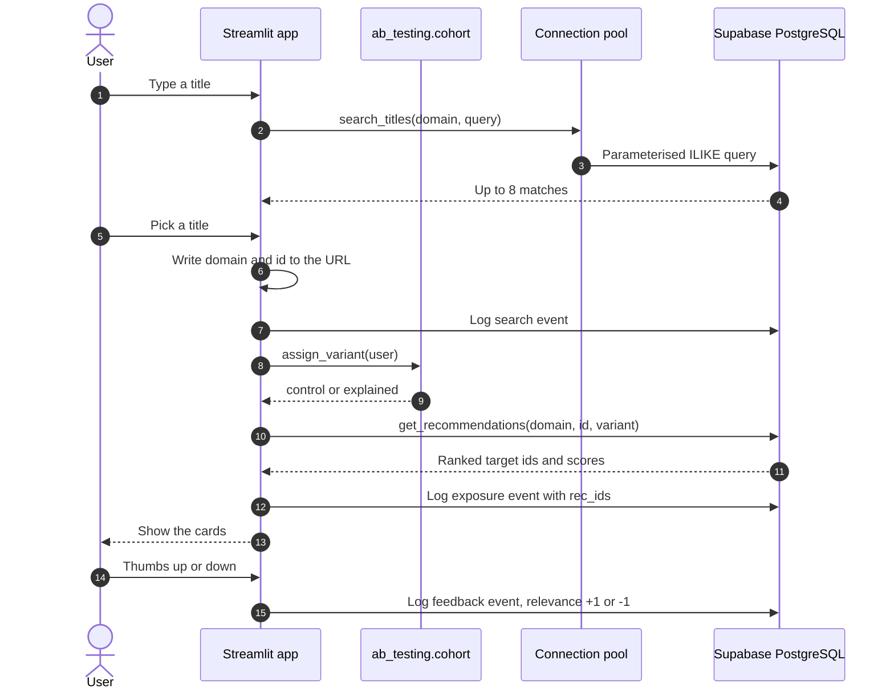
```mermaid
sequenceDiagram
    autonumber
    actor U as User
    participant S as Streamlit app
    participant C as ab_testing.cohort
    participant P as Connection pool
    participant D as Supabase PostgreSQL
    U->>S: Type a title
    S->>P: search_titles(domain, query)
    P->>D: Parameterised ILIKE query
    D-->>S: Up to 8 matches
    U->>S: Pick a title
    S->>S: Write domain and id to the URL
    S->>D: Log search event
    S->>C: assign_variant(user)
    C-->>S: control or explained
    S->>D: get_recommendations(domain, id, variant)
    D-->>S: Ranked target ids and scores
    S->>D: Log exposure event with rec_ids
    S-->>U: Show the cards
    U->>S: Thumbs up or down
    S->>D: Log feedback event, relevance +1 or -1
```

### UI navigation

The URL holds the domain and the title id. Refresh, Back and shared links reopen the same view (`src/ui/routing.py`).

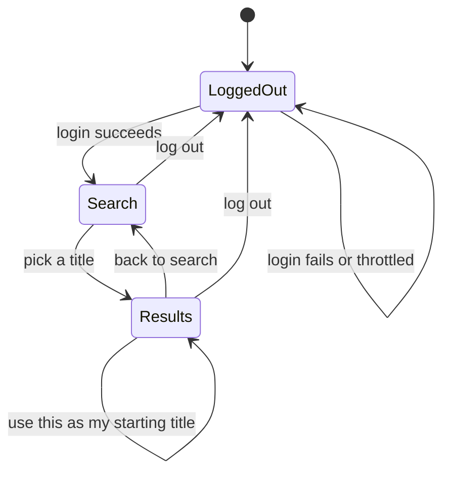
```mermaid
stateDiagram-v2
    [*] --> LoggedOut
    LoggedOut --> LoggedOut: login fails or throttled
    LoggedOut --> Search: login succeeds
    Search --> Results: pick a title
    Results --> Search: back to search
    Results --> Results: use this as my starting title
    Search --> LoggedOut: log out
    Results --> LoggedOut: log out
```

## Results

The table below is generated from `artefacts/metrics.json`. A model-improvement run is in progress, so the numbers can change.
Regenerate with `python scripts/make_diagrams.py`. The script rewrites the block between the markers, `docs/assets/results-table.md` and the bar chart.
The `artefacts/` folder stays out of git. Run `python -m src.evaluation.evaluate` first to create `metrics.json`.

<!-- results:start -->
Test split. Relevance: theme Jaccard >= 0.5. K = 10. Model version: `siamese-v2`. Seed: 42.

| Model | MAP@10 anime->game | MAP@10 game->anime | Mean MAP@10 | Mean P@10 | Mean Recall@10 |
|---|---|---|---|---|---|
| Random vectors | 0.0144 | 0.0122 | 0.0133 | 0.0348 | 0.0025 |
| TF-IDF + SVD | 0.0483 | 0.0458 | 0.0470 | 0.0921 | 0.0130 |
| Raw SBERT cosine | 0.0335 | 0.0425 | 0.0380 | 0.0820 | 0.0112 |
| Siamese | 0.0602 | 0.0842 | 0.0722 | 0.1358 | 0.0189 |
| Siamese + popularity prior | 0.0549 | 0.0875 | 0.0712 | 0.1317 | 0.0168 |

Base rate of a relevant candidate: 0.0357 (anime->game), 0.0349 (game->anime). Test contrastive loss: 0.0575 on 154536 pairs.

| Ablation | Mean MAP@10 | Note |
|---|---|---|
| Keyword-masked test games, raw SBERT | 0.0340 | Drop of 0.0041 |
| Keyword-masked test games, Siamese | 0.0636 | Drop of 0.0086 |
| No hard negatives, Siamese | 0.1027 | Test score. Selection used validation |
| Random vectors, 5 seeds | 0.0131 | Standard deviation 0.0005 |
| Siamese, 3 training seeds | 0.0766 | Standard deviation 0.0045 |
<!-- results:end -->

<p align="center">
  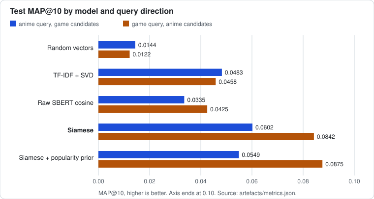
</p>

### Reading the results

The prose in this part reflects the metrics at the time of writing. The table holds the live numbers.

- **The target is not met.** `CLAUDE.md` sets a MAP@10 target of 0.82. The Siamese row sits far below it.
- **The model beats the baselines.** The Siamese model scores above random vectors, raw SBERT and TF-IDF + SVD. The gaps are small in absolute terms.
- **MAP@10 is low by design.** About 3.5% of candidates are relevant to any query. A random list already scores above zero.
- **The contrastive loss meets its target.** The test loss is below the 0.15 limit in `CLAUDE.md`. Pair loss alone does not show good ranking.
- **Keyword leakage matters.** Masking the lexicon keywords in test games lowers the Siamese score more than the raw SBERT score. The model uses some keywords.
- **Hard negatives did not help on test.** The run without hard negatives scores higher than the selected model. Selection used the validation split.
- **Tuning is noisy.** `artefacts/tuning_log.md` records that the seed spread on validation exceeds every tuning difference.
- **No user benefit is shown.** Offline MAP@10 on weak labels does not prove that users like the lists.

Read the full method, loss, splits and threats to validity in [docs/methodology.md](docs/methodology.md).
The review of the original dissertation pipeline is in [docs/dissertation-critique.md](docs/dissertation-critique.md).

## Quick start

Requirements: Python 3.13 or later and a Supabase project. The free tier is enough for the app.

**1. Create the environment.**

```
python -m venv .venv
```

Activate it.

```
# Windows PowerShell or cmd
.venv\Scripts\activate

# Git Bash, Linux or macOS
source .venv/Scripts/activate    # Git Bash on Windows
source .venv/bin/activate        # Linux or macOS
```

**2. Install the app dependencies.**

```
pip install -r requirements.txt
```

For the pipeline, tests and linting, install the development set. Install the CPU build of PyTorch first.

```
pip install torch --index-url https://download.pytorch.org/whl/cpu
pip install -r requirements-dev.txt
```

**3. Set the environment variables.** Copy `.env.example` to `.env` and fill in the names below. Never commit `.env`.
Streamlit also reads the same names from `.streamlit/secrets.toml`.

| Variable | Purpose |
|---|---|
| `DB_HOST`, `DB_PORT`, `DB_NAME`, `DB_USER`, `DB_PASSWORD` | Supabase session pooler connection |
| `RECOMMAL_AB_SALT` | Secret key for the A/B pseudonyms |

Generate a value for `RECOMMAL_AB_SALT` with a command that runs on both shells.

```
python -c "import secrets; print(secrets.token_urlsafe(48))"
```

**4. Create the schema and load data.**

```
python -m db.migrate_and_seed --migrate-only
python -m db.migrate_and_seed --fixtures
```

Use `python -m db.migrate_and_seed` without flags to load the real recommendations after you run the pipeline.

**5. Start the app.**

```
streamlit run app.py
```

### Run the pipeline (optional)

The pipeline needs the MAL and Steam SQL dumps. Set `RECOMMAL_RAW_DIR` to the folder that holds `sql/animes_db.sql` and `sql/steam_games.sql`.

```
python -m src.ingest.build_dataset
python -m src.embeddings.sbert
python -m src.ml.train
python -m src.evaluation.evaluate
python -m src.evaluation.recommend
python -m db.migrate_and_seed
python scripts/make_diagrams.py
```

## Project layout

```
recommal/
  app.py                   Streamlit entry point
  auth_utils.py            Registration, login, throttle
  src/
    config.py              Paths, hyperparameters, splits, A/B settings
    ingest/                Dump parsing, cleaning, theme taxonomy, REST clients
    embeddings/sbert.py    all-MiniLM-L6-v2 encoding
    ml/                    Pair mining, Siamese model, contrastive loss, training
    evaluation/            Metrics, baselines, leakage ablation, recommendation export
    db/                    Connection pool and parameterised queries
    ab_testing/            Cohort assignment and event logging
    ui/                    Components, routing, login throttle
  db/
    migrations/            Numbered SQL migrations
    migrate_and_seed.py    Apply migrations and load data
  scripts/make_diagrams.py Generate the results table and bar chart
  docs/                    Methodology, critique, deployment, assets
  tests/                   Unit, UI and browser smoke tests
  Dockerfile, render.yaml  Container image and Render blueprint
```

## Testing

CI runs these commands. See `.github/workflows/ci.yml`.

```
pytest -q --ignore=tests/e2e
ruff check .
mypy
```

The browser smoke test needs Playwright.

```
pytest -q tests/e2e
```

## Security notes

- **Row-Level Security.** RLS is on for every table. The REST API can read the catalogue and the recommendations only. `users`, `ab_test_events` and `login_attempts` have no policies.
- **Closed defaults.** Migration 002 revokes the default Supabase grants on future tables, sequences and functions.
- **Password storage.** The app stores bcrypt hashes. It rejects passwords above 72 bytes.
- **Login throttling.** The session throttle allows 5 failures, then waits 30 seconds and doubles up to 900 seconds. The server-side table `login_attempts` limits 5 failures in 15 minutes.
- **Pseudonyms.** Telemetry stores an HMAC-SHA256 pseudonym keyed by `RECOMMAL_AB_SALT`. It never stores an email address.
- **No salt, no protection.** Without `RECOMMAL_AB_SALT`, the app logs a warning and uses a public development key.
- **Queries and errors.** SQL uses `%s` placeholders. The UI shows fixed error messages and logs the exception.
- **Image URLs.** A check constraint allows `https://` image URLs only.
- **Secrets.** Credentials come from environment variables or `st.secrets`. CI scans for leaked secrets.

## Deployment

Streamlit needs a persistent WebSocket, so it cannot run on Vercel. The recommended free path is Docker on Render with a custom subdomain.
The idle service sleeps after about 15 minutes. See [docs/deployment.md](docs/deployment.md) for the steps, the variables, the DNS record and the alternatives.

## Limitations

- **Weak theme labels.** Relevance comes from genres and a keyword lexicon. Lexicon precision is not measured.
- **Text-derived game labels.** Game themes come partly from the text that SBERT encodes. The model can match keywords instead of meaning.
- **Thematic similarity only.** Theme overlap does not measure play experience or enjoyment.
- **Target not met.** The MAP@10 target of 0.82 is not met. See [Results](#results).
- **One data split.** Seed 42 drives every split. Three training seeds give a rough spread only.
- **Popularity bias.** The `explained` layout uses a popularity prior, which favours popular titles.
- **Confounded A/B test.** The `explained` layout changes ranking and explanation together. The test cannot separate them.
- **No user study.** The A/B test is small. It does not show that users prefer either layout.
- **Free-tier hosting.** The Render free service sleeps when idle and has 512 MB of RAM.

## Licence

No licence chosen yet. Until the owner adds a `LICENSE` file, all rights stay with the author.

## Acknowledgements and sources

- MyAnimeList data. Use follows the MyAnimeList terms.
- Steam data. Use follows the Steam terms.
- Sentence encoder: [`sentence-transformers/all-MiniLM-L6-v2`](https://huggingface.co/sentence-transformers/all-MiniLM-L6-v2).
- Contrastive loss: Hadsell, Chopra and LeCun (2006), "Dimensionality reduction by learning an invariant mapping".
- Hosting and database: Supabase PostgreSQL, Render, Streamlit.
